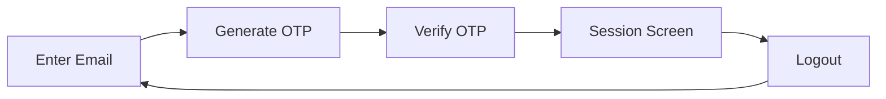

# 🔐 Lokal — Passwordless OTP Authentication

<div align="center">


**A modern Android app demonstrating passwordless email + OTP authentication**

Built with Kotlin, Jetpack Compose, MVVM architecture, and Coroutines

[Features](#-features) • [Architecture](#-architecture) • [Setup](#-setup-instructions) • [Tech Stack](#-tech-stack)

</div>

---

## 📱 App Overview

Lokal is a clean, production-ready demonstration of passwordless authentication using One-Time Passwords (OTP). This project showcases modern Android development practices, proper state management, and a seamless user experience.

### 🎯 User Flow



1. **Enter Email** — User provides their email address
2. **Generate OTP** — 6-digit OTP is generated and displayed (for demo purposes)
3. **Verify OTP** — User enters the OTP to authenticate
4. **Session Screen** — Active session with live duration tracking
5. **Logout** — End session and return to login

---

## ✨ Features

### 🔑 Email + OTP Authentication

- **Passwordless login** using email and OTP
- **6-digit OTP** generated locally for demo purposes
- **OTP display** for easy testing (production apps would send via email/SMS)
- **Secure verification** with proper validation and error handling

### ⏱️ OTP Security Rules

| Rule | Implementation |
|------|----------------|
| **OTP Length** | 6 digits |
| **Expiry Time** | 60 seconds |
| **Maximum Attempts** | 3 failed attempts allowed |
| **Resend OTP** | Invalidates old OTP & resets attempts |
| **Storage** | Stored per email using a Map |

### 📊 Session Management

After successful authentication:

- ✅ Displays logged-in email
- ✅ Shows session start time
- ✅ Live session duration counter (mm:ss format)
- ✅ Timer updates every second
- ✅ Clean logout with session duration logging

### 🔍 Analytics & Logging

Integrated **Timber** for comprehensive event tracking:

```kotlin
EVENT: OTP_GENERATED for email: user@example.com
EVENT: OTP_VALIDATION_SUCCESS for email: user@example.com
EVENT: LOGOUT for email: user@example.com, duration: 45s
```

**Tracked Events:**
- OTP Generation
- OTP Validation (Success/Failure)
- Logout with session duration

---


### Navigation via Sealed State

```kotlin
sealed class AuthState {
    object Initial : AuthState()
    data class OtpSent(
        val email: String,
        val otp: String,
        val expiryTime: Long
    ) : AuthState()
    data class Authenticated(
        val email: String,
        val sessionStartTime: Long
    ) : AuthState()
}
```

### Key Architecture Benefits

- ✅ **Single source of truth** with StateFlow
- ✅ **Separation of concerns** (UI, ViewModel, Business Logic)
- ✅ **Testable components** with clear boundaries
- ✅ **Type-safe navigation** using sealed classes

---

## 📂 Project Structure

```
com.lokal.otp/
│
├── ui/
│   ├── LoginScreen.kt       # Email input screen
│   ├── OtpScreen.kt          # OTP verification screen
│   └── SessionScreen.kt      # Active session display
│
├── viewmodel/
│   ├── AuthViewModel.kt      # Main ViewModel
│   ├── AuthState.kt          # Navigation states
│   └── OtpUiState.kt         # UI state models
│
├── data/
│   ├── OtpManager.kt         # OTP business logic
│   ├── OtpData.kt            # OTP data model
│   └── ValidationResult.kt   # Validation results
│
└── analytics/
    └── AnalyticsLogger.kt    # Timber logging wrapper
```

---

## 🧠 OTP Logic & Implementation

### OTP Data Storage

OTPs are stored per email using an in-memory map:

```kotlin
private val otpStore = mutableMapOf<String, OtpData>()

data class OtpData(
    val otp: String,
    val expiryTime: Long,
    var attemptsRemaining: Int
)
```

### Validation Flow

```
1. Check if OTP exists for email
           ↓
2. Verify OTP hasn't expired
           ↓
3. Check remaining attempts > 0
           ↓
4. Match entered OTP with stored OTP
           ↓
5. Update attempts or clear OTP data
```

### Expiry Countdown

A coroutine-based timer updates the countdown every second:

```kotlin
LaunchedEffect(expiryTime) {
    while (remainingTime > 0) {
        delay(1000L)
        remainingTime = (expiryTime - System.currentTimeMillis()) / 1000
    }
}
```

---

## 🧩 Jetpack Compose Concepts

| Concept | Usage |
|---------|-------|
| **@Composable** | All UI screens built with Composables |
| **remember** | Session timer state management |
| **rememberSaveable** | Email & OTP input persistence |
| **LaunchedEffect** | Countdown timers & side effects |
| **State Hoisting** | ViewModel → UI data flow |
| **StateFlow** | Reactive state management |

### Configuration Change Handling

- ✅ **Screen rotation safe** using `rememberSaveable`
- ✅ **ViewModel survives** configuration changes
- ✅ **No data loss** on orientation change

---

## 🛡 Edge Cases Handled

| Scenario | Handling |
|----------|----------|
| **Expired OTP** | Shows "OTP expired" error, prompts resend |
| **Incorrect OTP** | Decrements attempts, shows remaining count |
| **Exceeded Attempts** | Shows "Maximum attempts exceeded" error |
| **Resend OTP** | Invalidates old OTP, resets attempts to 3 |
| **Screen Rotation** | State persists using ViewModel & SavedState |
| **App Backgrounding** | Timer pauses/resumes correctly |

---

## 🛠 Setup Instructions

### Prerequisites

- Android Studio Hedgehog (2023.1.1) or later
- Minimum SDK: 24 (Android 7.0)
- Target SDK: 34 (Android 14)
- Kotlin 1.9+

### Installation

1. **Clone the repository**
   ```bash
   git clone https://github.com/yourusername/lokal-otp-auth.git
   cd lokal-otp-auth
   ```

2. **Open in Android Studio**
   - File → Open → Select project directory
   - Wait for Gradle sync to complete

3. **Run the app**
   - Connect an Android device or start an emulator
   - Click Run (▶️) or press `Shift + F10`

4. **No backend required** — Everything runs locally!

### Testing the App

1. Enter any valid email format (e.g., `test@example.com`)
2. Note the displayed 6-digit OTP
3. Enter the OTP within 60 seconds
4. Explore the session screen with live timer
5. Check Logcat for analytics events

---

## 🚀 Tech Stack

### Core Technologies

- **[Kotlin](https://kotlinlang.org/)** — Modern, concise, and safe programming language
- **[Jetpack Compose](https://developer.android.com/jetpack/compose)** — Declarative UI framework
- **[Coroutines](https://kotlinlang.org/docs/coroutines-overview.html)** — Asynchronous programming
- **[StateFlow](https://developer.android.com/kotlin/flow/stateflow-and-sharedflow)** — Reactive state management

### Architecture Components

- **[ViewModel](https://developer.android.com/topic/libraries/architecture/viewmodel)** — UI-related data holder
- **[Navigation Component](https://developer.android.com/guide/navigation)** — In-app navigation (via state)
- **[Lifecycle](https://developer.android.com/topic/libraries/architecture/lifecycle)** — Lifecycle-aware components

### Utilities

- **[Timber](https://github.com/JakeWharton/timber)** — Logging library

---

## 📸 Screenshots

<div align="center">

| Login Screen | OTP Verification | Session Screen |
|--------------|------------------|----------------|
|  |  |  |

</div>

---

## 🎓 Learning Outcomes

This project demonstrates:

- ✅ **MVVM architecture** implementation in Compose
- ✅ **State management** with StateFlow and Compose state
- ✅ **Coroutines** for background tasks and timers
- ✅ **Type-safe navigation** using sealed classes
- ✅ **Edge case handling** and validation
- ✅ **Analytics integration** with logging frameworks
- ✅ **Modern Android best practices**

---

## 🤖 AI Assistance Disclosure

ChatGPT was used for:
- Understanding coroutine timer patterns
- Compose layout guidance and best practices
- Timber logging implementation guidance

---


## 📄 License

This project was created as part of a technical assignment and is available for educational purposes.

---

## 👨‍💻 Author

**Sai Teja**

- GitHub: [Saiteja1102](https://github.com/Saiteja1102)
- LinkedIn: [saitejamakthala](https://www.linkedin.com/in/saitejamakthala/)
- Email: mstg1102@gmail.com

---

<div align="center">

**⭐ If you found this project helpful, please consider giving it a star!**

Made with ❤️ using Kotlin & Jetpack Compose

</div>
